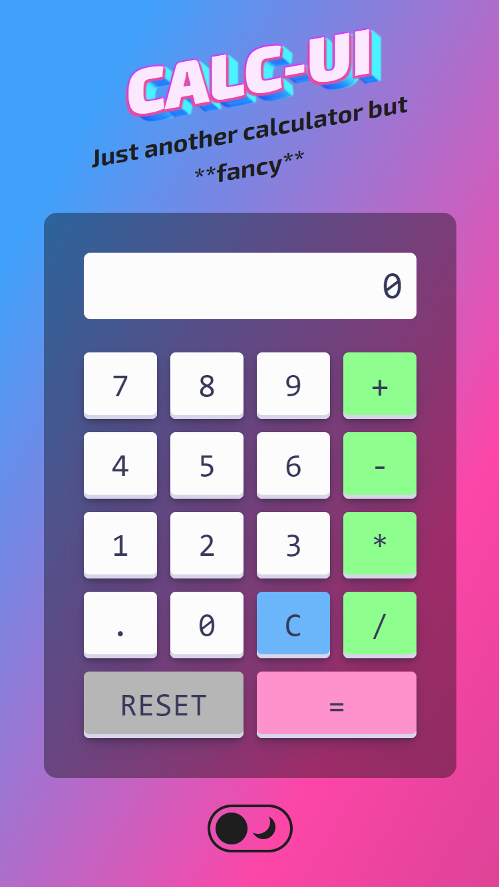

# Calc-UI

The fanciest calculator on the web.

<div align="center">
  
</div>

## Technologies

These are the technologies I've used

<div align="center">
  
  
  
</div>

## Installation ⚙️

1. Clone the repository:

```bash
git clone git@github.com:GomezJuanEfe/LAF-page.git
```

2. Install dependencies:

```bash
npm install
```

3. Run server:

```bash
npm run dev
```

## The Process 🏋️

### Code reusing

For many features on the application I used code from different people. In this section I want to acknowledge to Justin Schroeder and Mireille Tijdeman. Check on the links section which part of their work helped and inspired me to do this job.

### Mobile no hover

One of the things you may ask is how to deactivate the hover on mobile devices. Here we have two approaches:

Where the current device has a cursor that can hover.

```css
@media (hover: hover) {
  a:hover {
    /* hover styles */
  }
}
```

Applying styles only to devices that do not support hovering.

```css
@media (hover: none) {
  /* styles for touchscreen devices */
}
```

### Configuring GH-Pages for deploying

This part was very challenging cause I had to understand very well the vite config in order to deploy the project on GitHub Pages.

```javascript
export default defineConfig({
  plugins: [react()],
  base: "/calc-ui/",
  server: {
    host: "https://gomezjuanefe.github.io/",
  },
  build: {
    outDir: "dist",
  },
});
```

## Links ⛓️

- [Dark Mode](https://codepen.io/justin-schroeder/pen/zYyVvxQ) - I took this page as reference to build the dark mode.
- [Fancy Title](https://codepen.io/mireille1306/pen/BawdXzY) - I took this page as reference to build the title.
- [Free Frontend](https://freefrontend.com/) - An amazing site to find inspiration
- SCC [Scan](https://getcssscan.com/) is an applicatio to check and copy the css properties of an element. They also have some free amazing tools:
  - [Beautiful CSS box-shadow examples](https://getcssscan.com/css-box-shadow-examples)
  - [Beautiful CSS buttons examples](https://getcssscan.com/css-buttons-examples)
  - [Beautiful CSS checkboxes examples](https://getcssscan.com/css-checkboxes-examples)
  - [CSS shapes examples](https://getcssscan.com/css-shapes)

## What's next ⏭️

Some of the libraries I would like to implement soon:

- [GSAP](https://gsap.com)
- [Framer Motion](https://www.framer.com/motion/)
